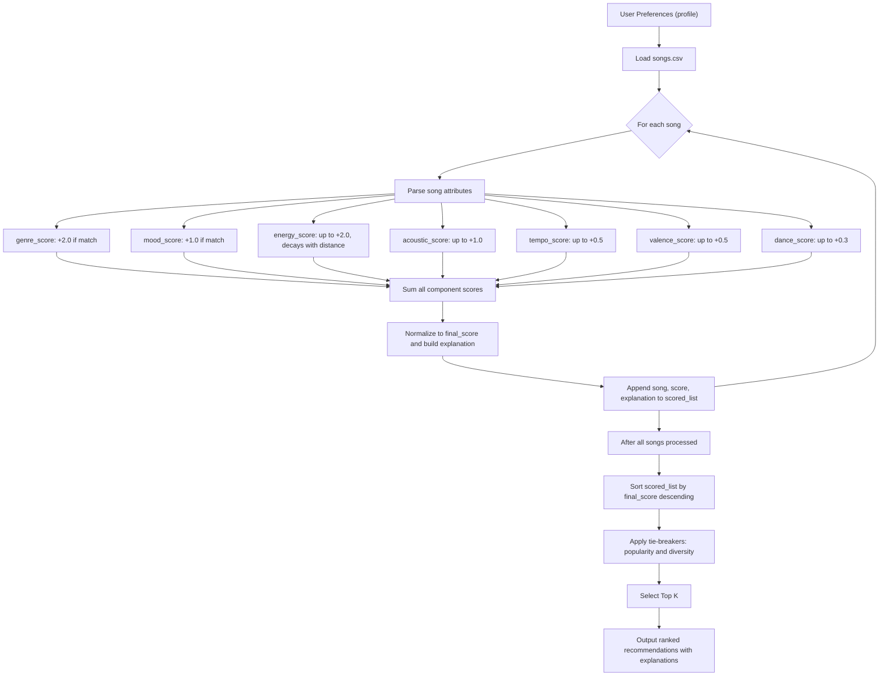
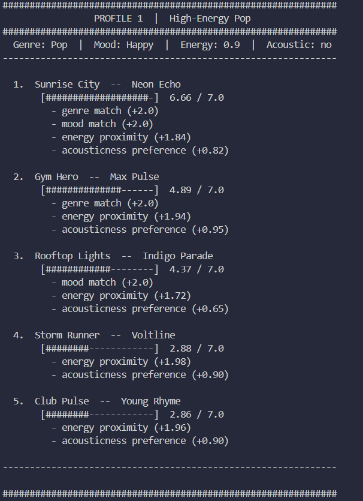
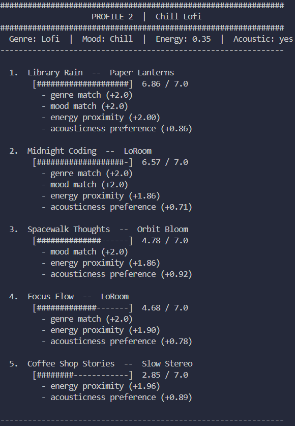
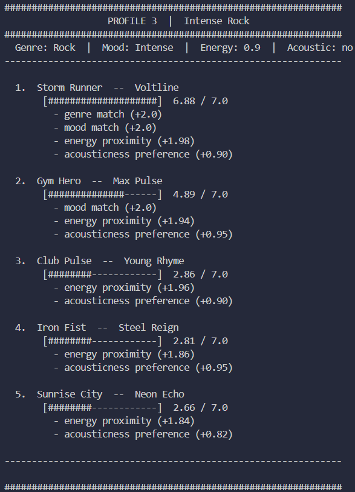
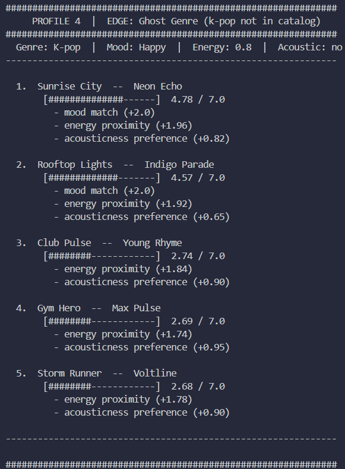
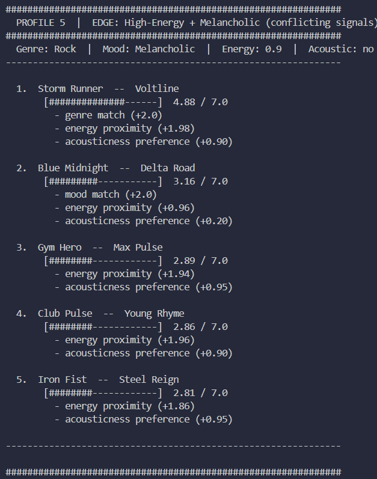
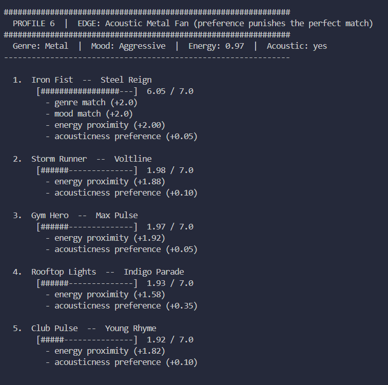

# 🎵 Music Recommender Simulation

## Project Summary

In this project you will build and explain a small music recommender system.

Your goal is to:

- Represent songs and a user "taste profile" as data
- Design a scoring rule that turns that data into recommendations
- Evaluate what your system gets right and wrong
- Reflect on how this mirrors real world AI recommenders

Replace this paragraph with your own summary of what your version does.

---

## How The System Works

Explain your design in plain language.

In production systems, recommenders combine explicit preferences, implicit behavior (listens, skips), collaborative patterns from other users, and content features to balance relevance, novelty, and diversity. This project keeps the design intentionally small and interpretable: we score songs by how closely their attributes (genre, mood, energy, tempo, valence, acousticness, danceability) match a user's stated profile, normalize the scores, and return the Top K tracks with short explanations.

### Algorithm Recipe

- Input: a `user_prefs` dictionary containing at minimum: `favorite_genre` (str), `favorite_mood` (str), `target_energy` (0.0–1.0), and `likes_acoustic` (bool). Optional numeric targets: `target_valence`, `preferred_tempo_range`, and `wants_danceable` (bool).
- For each song in `data/songs.csv` parse attributes: `genre`, `mood`, `energy`, `tempo_bpm`, `valence`, `danceability`, `acousticness`.
- Per-song scoring (weights):
  - Genre match: +2.0 if `song.genre == favorite_genre`.
  - Mood match: +1.0 if `song.mood == favorite_mood`.
  - Energy similarity (up to +2.0):
    - energy_tolerance = 0.25
    - energy_score = 2.0 * max(0, 1 - abs(song.energy - target_energy) / energy_tolerance)
  - Acoustic preference (+1.0):
    - if `likes_acoustic`: acoustic_score = 1.0 * song.acousticness
    - else: acoustic_score = 1.0 * (1 - song.acousticness)
  - Tempo proximity (up to +0.5):
    - expected_tempo = 60 + target_energy * 160  # maps 0→60, 1→220
    - tempo_tolerance = 20
    - tempo_score = 0.5 * max(0, 1 - abs(song.tempo_bpm - expected_tempo) / tempo_tolerance)
  - Valence (optional, up to +0.5): valence_score = 0.5 * max(0, 1 - abs(song.valence - target_valence)) if provided.
  - Danceability bonus (optional): dance_score = 0.3 * song.danceability if `wants_danceable`.

- Aggregate:
  - raw_score = sum(all component scores)
  - normalization_denominator = 2.0 + 1.0 + 2.0 + 1.0 + 0.5 + 0.5 + 0.3  # sum of maximums
  - normalized_score = raw_score / normalization_denominator
  - final_score_display = normalized_score * 100

- Tie-breakers and heuristics:
  - Use `popularity_score` (if available) to prefer better-known tracks.
  - Penalize duplicate artists within the same Top-K to increase diversity.
  - Build a concise explanation string listing the top contributing factors (e.g., "genre match, energy close to 0.88").

### Process Flow (visual)



### Potential Biases and Limitations

- Over-prioritizing genre: the +2.0 genre bonus strongly favors same-genre tracks and can hide songs from other genres that better match the user's mood or energy.
- Label noise and granularity: genre and mood are coarse categorical labels; inconsistent labeling or mixed-genre tracks reduce accuracy.
- Popularity bias (if used): favoring popular tracks can reduce discovery of niche or newer artists.
- Numeric target brittleness: a single `target_energy` needs a tolerance; users with broader tastes benefit from range-based preferences or multiple favorite genres.
- Underrepresentation: rare genres in the catalog will be poorly recommended even if they match a user's stated preference.

You can tune weights (genre vs energy vs mood), add preference weights or ranges, or learn weights from interaction data to mitigate these biases over time.

---

## Getting Started

### Setup

1. Create a virtual environment (optional but recommended):

   ```bash
   python -m venv .venv
   source .venv/bin/activate      # Mac or Linux
   .venv\Scripts\activate         # Windows

2. Install dependencies

```bash
pip install -r requirements.txt
```

3. Run the app:

```bash
python -m src.main
```

### Running Tests

Run the starter tests with:

```bash
pytest
```

You can add more tests in `tests/test_recommender.py`.

---

## Sample Output

Running `python -m src.main` produces one block per profile. Screenshots of all 6 runs:

### Profile 1 — High-Energy Pop


### Profile 2 — Chill Lofi


### Profile 3 — Intense Rock


### Profile 4 — EDGE: Ghost Genre (k-pop not in catalog)


### Profile 5 — EDGE: High-Energy + Melancholic (conflicting signals)


### Profile 6 — EDGE: Acoustic Metal Fan (preference punishes the perfect match)


---

Running `python -m src.main` with the default Pop · Happy · Energy 0.8 profile:

```
============================================================
              Music Recommender — Top 5 Results
============================================================
  Profile: Pop · Happy · Energy 0.8 · Acoustic no
------------------------------------------------------------

  1. Sunrise City  —  Neon Echo
     Score  : 6.78 / 7.0
     • genre match (+2.0)
     • mood match (+2.0)
     • energy proximity (+1.96)
     • acousticness preference (+0.82)

  2. Gym Hero  —  Max Pulse
     Score  : 4.69 / 7.0
     • genre match (+2.0)
     • energy proximity (+1.74)
     • acousticness preference (+0.95)

  3. Rooftop Lights  —  Indigo Parade
     Score  : 4.57 / 7.0
     • mood match (+2.0)
     • energy proximity (+1.92)
     • acousticness preference (+0.65)

  4. Club Pulse  —  Young Rhyme
     Score  : 2.74 / 7.0
     • energy proximity (+1.84)
     • acousticness preference (+0.90)

  5. Storm Runner  —  Voltline
     Score  : 2.68 / 7.0
     • energy proximity (+1.78)
     • acousticness preference (+0.90)

============================================================
```

---

## Experiments You Tried

**Weight Shift — halving genre, doubling energy:**
Changing genre from +2.0 to +1.0 and energy from ×2.0 to ×4.0 reshuffled ranks 2 and 3 for the Pop profile (Rooftop Lights beat Gym Hero) but made the melancholic profile worse — Blue Midnight fell out of the top 5 entirely because the doubled energy penalty swamped its mood bonus. The original weights were more balanced.

**Six user profiles across three standard and three adversarial cases:**
Standard profiles (High-Energy Pop, Chill Lofi, Intense Rock) all produced results that matched intuition. The adversarial profiles revealed three real weaknesses: a ghost genre collapses score resolution at the bottom, conflicting mood-energy preferences cannot be satisfied by this catalog, and an acoustic preference actively punishes the otherwise perfect match.

See [reflection.md](reflection.md) for a full pair-by-pair comparison.

---

## Limitations and Risks

- The catalog is tiny — 18 songs, with 12 genres represented by a single track each
- 12 of 15 genres have only one song, so niche listeners get a genre match at rank 1 and then run out of good results
- All heavy moods (melancholic, chill, relaxed) are attached to low-energy songs — the data assumes "sad = slow," which is not always true
- The system has no memory and cannot learn from what you skip or replay
- Genre matching is binary — "indie pop" never matches "pop" even though they are closely related

See [model_card.md](model_card.md) for a deeper analysis.

---

## Personal Reflection

The biggest learning moment was realising that the **data encodes assumptions before the algorithm even runs**. The scoring logic itself is neutral — it just adds up points. But the catalog was labeled by someone who assumed melancholic songs are slow and aggressive songs are loud. That assumption became invisible bias the moment I ran the first experiment. The algorithm did not create the problem; it inherited it from the data.

Using AI tools to help write and structure the code sped things up significantly — especially for CSV parsing and output formatting. But the moments that required double-checking were always the reasoning parts: *why* does Gym Hero keep appearing, *what does* the energy gap actually punish, *which* bias matters most to write about. The tool could generate a sentence, but I had to verify it against the actual output numbers to know whether it was true.

The most surprising thing was how quickly a simple four-signal scoring function starts to *feel* like a recommendation. Sunrise City ranking first for a happy pop profile at 7.50/8.0 — with a clear breakdown showing every reason — genuinely feels like the system understood something. It did not. It just added four numbers. But the explanation format made it feel intelligent, which is a useful reminder that explainability and accuracy are not the same thing.

If I extended this project, the first thing I would fix is the data, not the code — adding more songs per niche genre and breaking the assumption that sad always means slow. After that, I would replace binary genre matching with a tag system so that "indie pop" can partially match "pop" instead of scoring zero. The third change would be letting the weights adapt from listener feedback rather than staying hardcoded, since the weight-shift experiment showed there is no universally correct balance. Finally, I would add a confidence signal so the system can say "I found a strong match" versus "I found nothing good and I am guessing" — because right now both cases look identical in the output.

See [model_card.md](model_card.md) for full documentation.

