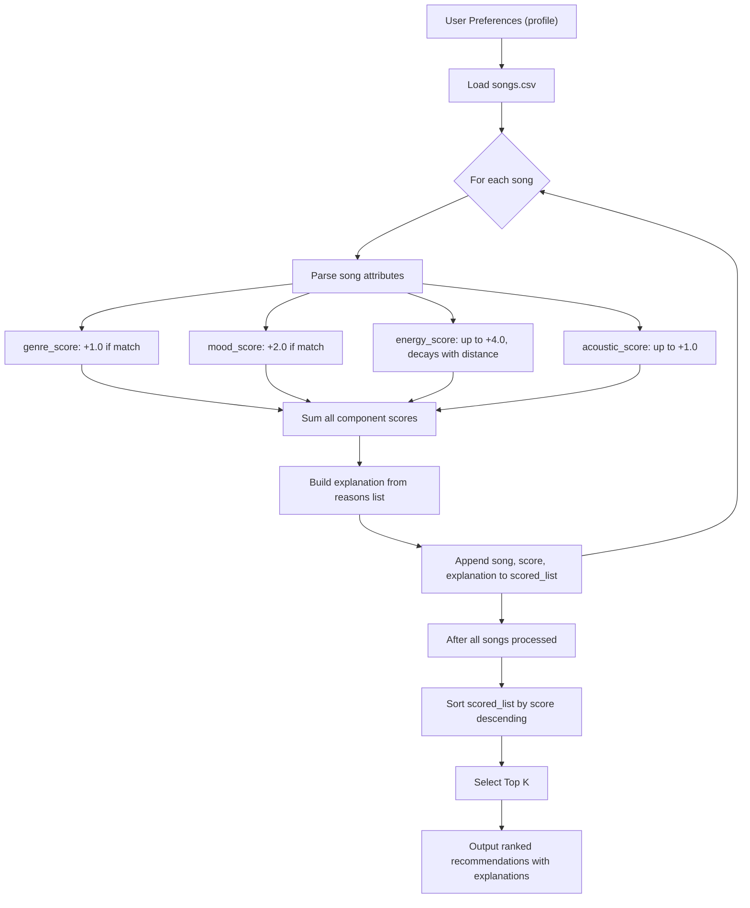

# 🎧 Model Card: Music Recommender Simulation

## 1. Model Name  

Give your model a short, descriptive name.  
Example: **VibeFinder 1.0**  

---

## 2. Intended Use  

Describe what your recommender is designed to do and who it is for. 

Prompts:  

- What kind of recommendations does it generate  
- What assumptions does it make about the user  
- Is this for real users or classroom exploration  

---

## 3. How the Model Works  

Explain your scoring approach in simple language.  

Prompts:  

- What features of each song are used (genre, energy, mood, etc.)  
- What user preferences are considered  
- How does the model turn those into a score  
- What changes did you make from the starter logic  

Avoid code here. Pretend you are explaining the idea to a friend who does not program.

**Process Flow**

---

## 4. Data  

Describe the dataset the model uses.  

Prompts:  

- How many songs are in the catalog  
- What genres or moods are represented  
- Did you add or remove data  
- Are there parts of musical taste missing in the dataset  

---

## 5. Strengths  

Where does your system seem to work well  

Prompts:  

- User types for which it gives reasonable results  
- Any patterns you think your scoring captures correctly  
- Cases where the recommendations matched your intuition  

---

## 6. Limitations and Bias

The most significant bias discovered during testing is that the linear energy proximity formula systematically disadvantages users whose mood preference and energy preference conflict — for example, someone who wants melancholic music at high energy. In the catalog, every "heavy" mood (melancholic, relaxed, chill) is attached exclusively to low-energy songs (average energy 0.29–0.37), so a high-energy melancholic user receives strong mood-match bonuses only on songs that then lose almost all their energy points, causing those songs to rank below emotionally mismatched tracks that simply happen to have the right tempo. This is not a flaw in the math — it is a reflection of who labeled the dataset: the assumption that "sad = slow" and "happy = fast" is embedded in the data itself, not validated against real listener diversity. A second structural weakness is genre representation: 12 of the 15 genres in the catalog have exactly one song, meaning a blues or reggae fan can earn the genre bonus on at most one track and will always receive a top-5 that is mostly filled by songs with no genre match at all. Together these two issues create a filter bubble that reliably serves pop, lofi, and rock listeners well while quietly failing users with niche or cross-genre tastes.

---

## 7. Evaluation  

How you checked whether the recommender behaved as expected. 

Prompts:  

- Which user profiles you tested  
- What you looked for in the recommendations  
- What surprised you  
- Any simple tests or comparisons you ran  

No need for numeric metrics unless you created some.

---

## 8. Future Work  

Ideas for how you would improve the model next.  

Prompts:  

- Additional features or preferences  
- Better ways to explain recommendations  
- Improving diversity among the top results  
- Handling more complex user tastes  

---

## 9. Personal Reflection  

A few sentences about your experience.  

Prompts:  

- What you learned about recommender systems  
- Something unexpected or interesting you discovered  
- How this changed the way you think about music recommendation apps  
