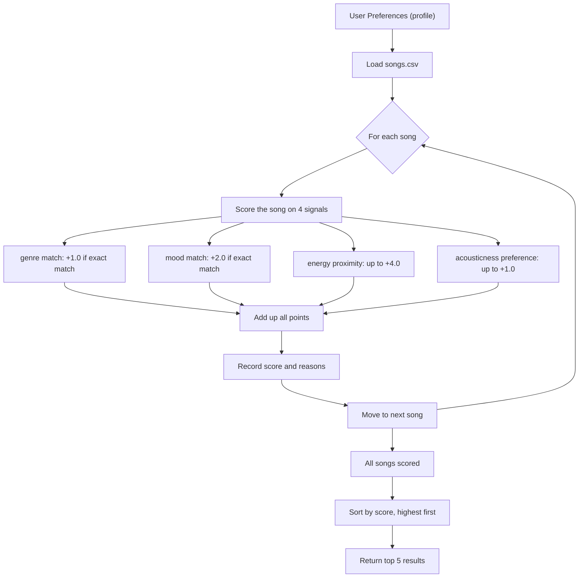

# 🎧 Model Card: Music Recommender Simulation

## 1. Model Name

**VibeMatch 1.0**

A rule-based music recommender that scores songs against a listener's stated preferences and returns the top matches with plain-language explanations.

---

## 2. Goal / Task

VibeMatch tries to answer one question: *"Given what a user says they like, which songs in the catalog feel the most like a match?"*

It does not learn from listening history. It does not know what you skipped or replayed. It only uses what you tell it — your favourite genre, mood, energy level, and whether you prefer acoustic sound. This makes it transparent and easy to inspect, but also limited to what you explicitly describe.

This system is for classroom exploration, not real-world deployment.

---

## 3. Algorithm Summary

For every song in the catalog, VibeMatch asks four questions and awards points for each one:

1. **Does the genre match?** If the song's genre equals the user's favourite genre, it gets +1.0 point. No partial credit — it either matches or it doesn't.

2. **Does the mood match?** If the song's mood label equals the user's preferred mood, it gets +2.0 points. Mood is worth more than genre because it captures emotional feel more directly.

3. **How close is the energy?** Energy is a number from 0.0 (very quiet/slow) to 1.0 (very loud/fast). The closer the song's energy is to what the user wants, the more points it earns — up to +4.0 for a perfect match, scaling down the further away it is.

4. **Does the acoustic preference match?** If the user likes acoustic music, songs with high acousticness get more points. If they prefer non-acoustic, songs with low acousticness get more points. Max +1.0.

The four scores are added together (max 8.0). All songs are then sorted from highest to lowest, and the top 5 are returned with a line explaining which signals contributed.

**Process Flow**

---

## 4. Data Used

- **Catalog size:** 18 songs
- **Features per song:** genre, mood, energy (0–1), tempo in BPM, valence, danceability, acousticness (0–1)
- **Genres covered:** lofi, pop, rock, indie pop, ambient, jazz, synthwave, hip-hop, classical, country, reggae, metal, folk, blues, R&B — 15 genres total
- **Moods covered:** chill, happy, intense, melancholic, romantic, relaxed, moody, focused, party, nostalgic, soulful, aggressive — 12 moods total

**Limits of the data:**
- 12 of 15 genres have only one song. A blues fan can only ever match one track on genre.
- All heavy or sad moods (melancholic, relaxed, chill) are attached to low-energy songs. There are no fast, sad songs. This reflects the assumptions of whoever built the dataset — not actual listener diversity.
- No lyrics, no language, no cultural context. A song is just its numbers.

---

## 5. Strengths

- **Works well for mainstream taste profiles.** A pop/happy listener gets Sunrise City at rank 1 with a score of 7.50/8.0. The result feels right.
- **Works well when preferences are consistent.** The chill/lofi profile produced a near-perfect top 2 (Library Rain at 7.86) because genre, mood, energy, and acousticness all pointed in the same direction.
- **Explanations are honest.** Every result shows exactly which signals fired and how many points each one contributed. There is no black box — you can see exactly why a song ranked where it did.
- **Edge cases are visible.** When the system cannot satisfy a request (like a ghost genre or conflicting signals), the low scores and thin explanations make that failure obvious rather than hiding it.

---

## 6. Limitations and Bias

The most significant bias is that the catalog assumes mood and energy always go together. Every melancholic or chill song in the data has low energy (below 0.4). Every intense or aggressive song has high energy (above 0.9). So if you want melancholic music at high energy — which is a real thing, think dark electronic music or post-rock — the system cannot find it. It will give you the one melancholic song that exists, but penalise it heavily for having the wrong energy, and fill your top 5 with fast, emotionally irrelevant songs instead.

A second problem is genre scarcity. Lofi has 3 songs, pop has 2, and everything else has 1. A blues fan gets the genre bonus on exactly one track. After that, ranks 2–5 are filled by whatever scores best on energy — not by anything close to blues. The system quietly fails niche listeners without telling them why.

Together these two issues create a filter bubble: pop, lofi, and rock listeners are well served by this catalog. Everyone else is not.

---

## 7. Evaluation Process

Six user profiles were tested and compared in pairs:

- **High-Energy Pop and Chill Lofi** — confirmed the system responds correctly to opposite preferences. The Lofi profile produced a tighter, higher-scoring top 2, which revealed that the catalog is actually better stocked for chill listeners than for pop listeners.

- **High-Energy Pop and Intense Rock** — both want energy 0.9, different genre and mood. Gym Hero appeared in both top-5 lists but for different reasons (genre match for Pop, mood match for Rock). Same score, different story.

- **High-Energy Pop and Ghost Genre (k-pop)** — removing the genre match showed how much the bottom of the list degrades when one signal is missing. Positions 3–5 became nearly tied and essentially random.

- **Intense Rock and High-Energy + Melancholic** — the clearest failure case. The only melancholic song near the right energy level (Blue Midnight) scored just 3.16 and disappeared entirely when energy weights were doubled, confirming that conflicting mood-energy preferences cannot be satisfied by this catalog.

- **Intense Rock and Acoustic Metal Fan** — showed that the acoustic preference can punish the perfect match. Iron Fist was the right genre, mood, and energy — but its low acousticness score dragged it below its theoretical maximum. The gap to rank 2 was nearly 4 points.

A weight-shift experiment was also run: genre was halved (+2.0 to +1.0) and energy was doubled (×2.0 to ×4.0). The rankings shifted but did not improve. Songs with the right energy but the wrong mood rose unfairly. The original weights were more balanced.

---

## 8. Intended Use and Non-Intended Use

**Intended use:**
- Learning how a rule-based recommender works
- Exploring how scoring weights change results
- Practising with data, scoring functions, and Python output formatting

**Not intended for:**
- Real music apps or production use
- Users who expect personalised recommendations — the system has no memory, no listening history, and no way to learn your taste over time
- Catalogs larger than a few dozen songs — the scoring logic does not scale or adapt
- Any use case where the person expects results to be fair across all genres and moods — as shown above, the system reliably underserves niche listeners

---

## 9. Ideas for Improvement

1. **Add more songs per genre.** The single biggest fix would be expanding the catalog so that every genre has at least 3–5 songs. Right now, niche listeners run out of good matches after rank 1.

2. **Treat mood and energy as independent signals.** Real listeners do not always pair them the way this dataset does. One improvement would be to add songs that break the assumption — fast melancholic tracks, slow energetic ones — so the scoring system can actually satisfy those requests.

3. **Replace binary genre matching with genre similarity.** Right now, "indie pop" never matches "pop" even though they are closely related. A simple grouping or tag system (e.g., both tagged `guitar-driven`) would help surface related songs instead of returning nothing on a genre miss.
